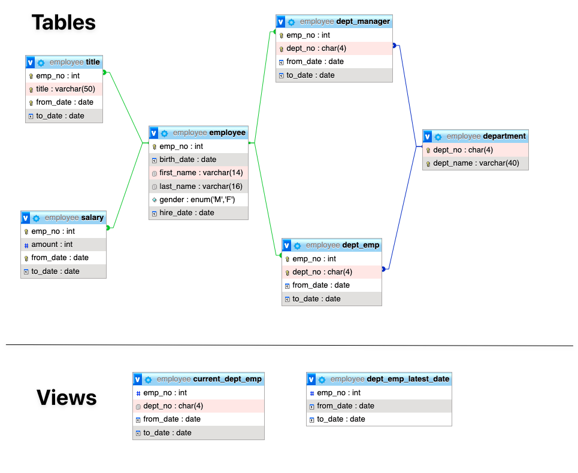

## Tasks
1. in Docker-compose create mysql 5.7 server
2. create read only user named "manager"
3. restore employees dump data from link
4. backup data (put command here)
5. check whether upgrade to 8.0 is possible using mysqlsh (put command here)
6. upgrade database to 8.0.35 version
7. Using "manager" user get all employees names and job title who have yearly salary bigger than 144000 Euro. Put results here.

## Schema

